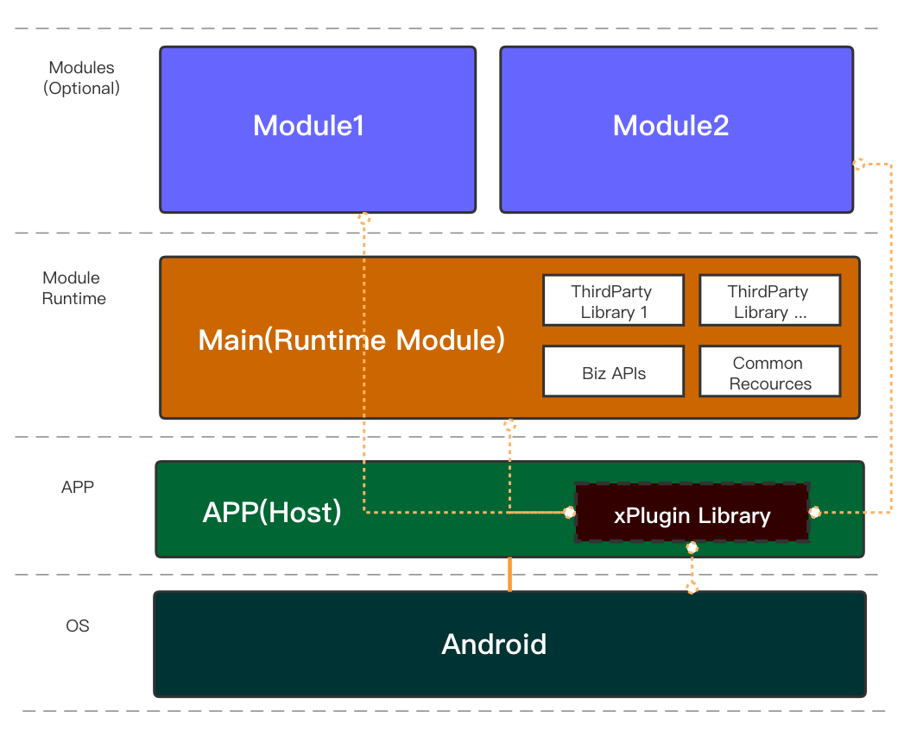

# xPlugin

### 一. 介绍
`Android消息化插件框架` 利用消息最大化解耦, 使插件在启动时可异步加载, 提高应用启动效率. 
目前所有接口通过Android API [19, 30] 各版本兼容测试.

#### 特性:
1. `资源共享`: 可指定Runtime Module, 其他Module可使用其提供的类型和资源.
2. `资源隔离`: 每个插件模块尽量使用自己内部的类型和资源, 避免类型和资源冲突问题.
3. `消息通信`: 模块间通过消息通信实现相互调用, 最大化的解耦, 延迟加载依赖, 在模块被调用时加载(可设置自动异步加载依赖模块).
4. `接近原生`: 接近原生方式使用系统API, 部分限制及解决方法参考如下信息. 

##### 限制:
* `Activity`: 不支持外部应用直接启动, 如有需要建议在宿主中注册 或 实现自定义Activity进行跳转.
* `Service`: 不支持外部应用直接启动, 使用场景有限, 更新不频繁, 如有需要建议在宿主中注册.
* `Broadcast`: 使用动态注册实现, 需要应用处于运行状态, 如需实现静态注册建议在宿主中注册.
* `ContentProvider`: 不支持外部应用直接启动, 如有需要建议在宿主中注册.
* `系统进程资源问题`: Notification等需要系统进程加载应用内资源的情况, 建议由应用包装包接口供插件使用.
* `overridePendingTransition动画资源问题`: 类似系统进程资源问题, 但可以在宿主中添加同名资源, 或通过 ActivityHelper#registerOverridePendingTransitionAnimId 设置映射关系, 框架将自动处理加载过程.

### 二. 软件架构


`注意`: Demo工程中main模块编译完成后会在runtime目录输出其他Module依赖的资源文件, 使得其他Module可以使用Runtime Module提供的类型和资源.

### 三. 常用接口
1. `PluginRuntime`: 插件初始化入口类, 在Application初始化时使用.
2. `Installer`: 插件安装及加载的工具类, 从这里可以获取已安装和已加载的插件的信息.
3. `PluginMsg`: 插件消息, 插件之间通信.
4. `PluginEntry`: 消息注册的入口, 类名约定: $packageName.PluginEntry 的形式; 为方便集成到对外sdk, 宿主的PluginEntry可通过初始化接口指定.
5. `Plugin`: 宿主(Host)和子模块(Module)的父类, 通过 Plugin.getPlugin(插件中的类型或其实例) 可以获取对应插件的信息.

### 四. 初始化

1. gradle添加依赖:
```groovy
// 最低gradle编译插件版本要求 com.android.tools.build:gradle:4.0.0

// 宿主中
implementation 'org.xutils:xutils:3.9.0'
implementation 'org.xplugin:xplugin:1.3.8'
// 插件中
compileOnly 'org.xutils:xutils:3.9.0' // 可选
compileOnly 'org.xplugin:xplugin:1.3.8'
```
2. 初始化接口示例: [MyApplication](app/src/main/java/org/xplugin/demo/app/MyApplication.java)
3. 在宿主或插件中的Manifest中添加 dependence 信息, 框架将自动异步加载依赖的插件模块, 参考 [AndroidManifest.xml](app/src/main/AndroidManifest.xml)
4. gradle配置参考示例工程, 注意插件模块的 packageId >= 0x70, 但不要设置为 0x7F, 示例:
```groovy
aaptOptions {
    // 使用小于0x80的packageId需要添加 '--allow-reserved-package-id'
    // additionalParameters '--allow-reserved-package-id', '--package-id', '0x72',
    additionalParameters '--package-id', '0x80'
}
```

### 五. 插件中使用 Activity

参考main工程的示例 [更多信息](docs/DefaultTplActivity.md)

### 六. 插件中使用 Service

参考main工程的示例

### 七. 插件中使用 Broadcast

参考main工程的示例

### 八. 插件中使用 ContentProvider

参考main工程的示例

### 九. 插件间消息调用

参考示例代码中 PluginEntry 和 PluginMsg 的使用.

### 其他

#### 示例工程编译:
1. 清理编译缓存: ./gradlew clean
2. 编译main模块: ./gradlew main:build
3. 编译module1模块: ./gradlew module1:build
4. 编译module2模块: ./gradlew module2:build

#### 关于主题
Android API 28 以下系统不支持引用 Runtime Module 的主题, 
包含主题的资源包需要以 implementation 依赖方式编译进入插件包.

#### styleable 反射获取问题
如有使用 `Class.forName(packageName + ".R$styleable").getFields()` 反射获取styleable资源的情况, 
建议修改为 `R.styleable.class.getFields()` 方式反射获取, 兼容性会更好. 
否则, 需要在插件编译时添加:
```groovy
aaptOptions {
    additionalParameters '--java', 'src/main/java', '--custom-package', 'app_packageName'
}
```